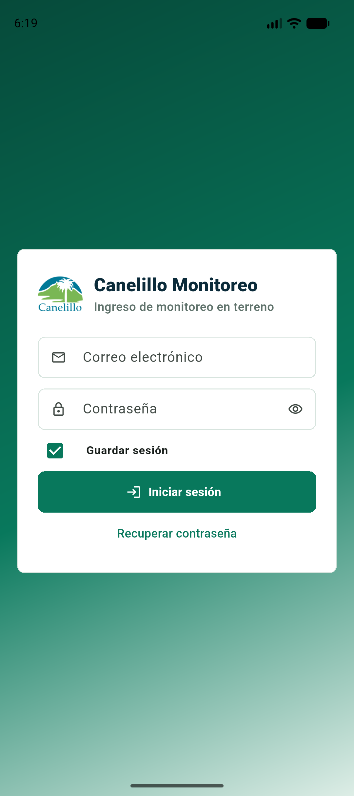

# Canelillo Monitoreo

Aplicacion Flutter para registrar arboles y monitoreos de plagas en terreno.



## Funciones

- Inicio de sesion con Supabase y opcion de conservar la sesion.
- Recuperacion de contrasena por correo.
- Mapa hibrido con poligonos oficiales de bloques.
- Vista de mapa de calor para analizar presencia por plaga y periodo.
- Vista de puntos con los iconos de plagas definidos en QGIS.
- Capa independiente de arboles, activable en calor o puntos.
- Ubicacion actual visible y acceso rapido para centrar el mapa.
- Panel superior plegable mediante flecha o gesto vertical.
- Vista de mapa respetando el area segura inferior del telefono.
- Alta y correccion de arboles mediante GPS o posicion manual.
- Captura de etapas configurables por tipo de plaga.
- Registro explicito de monitoreos sin presencia.
- Cache SQLite y cola offline con sincronizacion idempotente.
- Indicadores de carga para autenticacion, ubicacion, guardado y sincronizacion.

## Base de datos

Ejecutar en Supabase, en este orden, las migraciones ubicadas en la raiz de
AgroCore:

1. `supabase_monitoreo_plagas.sql`
2. `supabase_monitoreo_arboles.sql`
3. `supabase_monitoreo_arboles_import.sql`
4. `supabase_monitoreo_plagas_movil.sql`

La ultima migracion agrega catalogo de plagas, correlativos, autoria,
identificadores idempotentes y validaciones para captura movil.

## Google Maps

Android lee la clave desde `android/local.properties`, archivo excluido de Git:

```properties
GOOGLE_MAPS_API_KEY=clave_android
```

Para iOS se debe configurar una clave restringida al bundle
`com.canelillo.canelilloMonitoreo` antes de compilar en macOS.

## Ejecutar

```powershell
flutter pub get
flutter run
```

## Verificar

```powershell
flutter analyze
flutter test
flutter build apk --debug
```

El APK de desarrollo queda en
`build/app/outputs/flutter-apk/app-debug.apk`.
